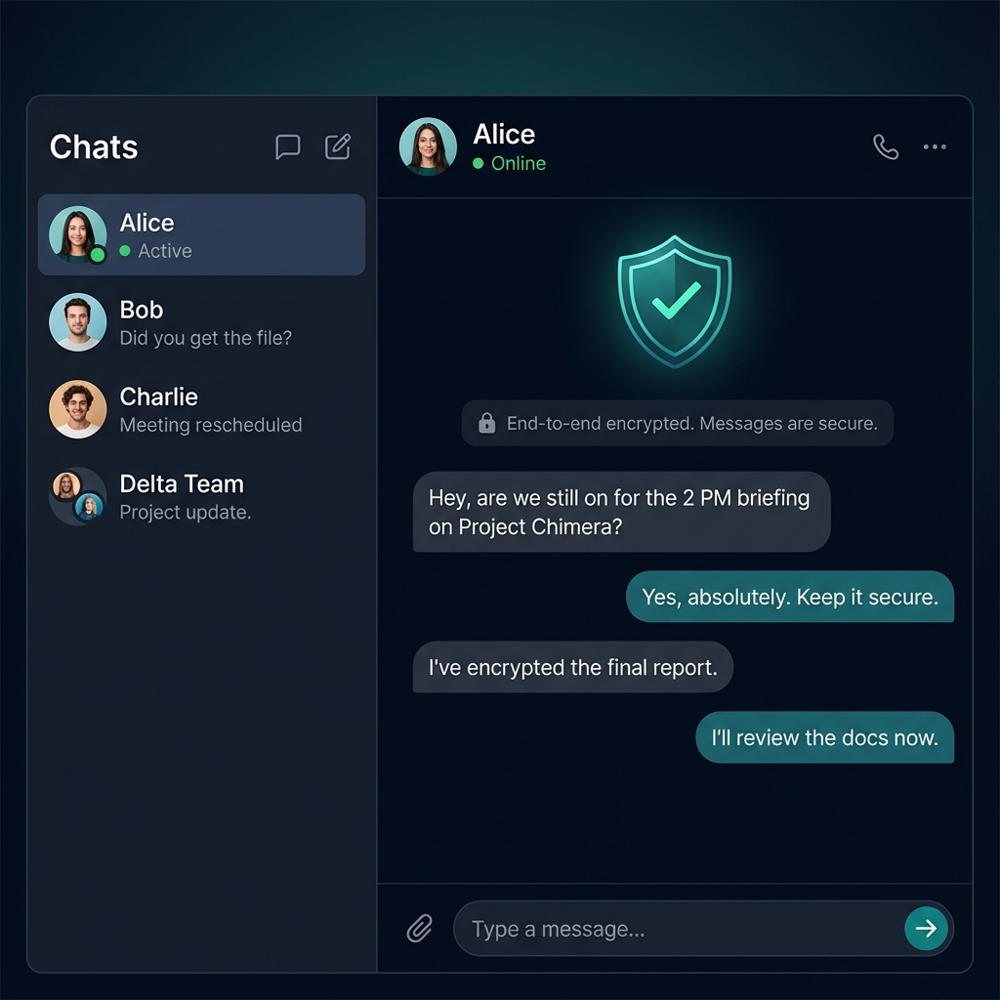

# 🔐 SecureChat - End-to-End Encrypted Real-Time Messaging

A WhatsApp-like chat application with **military-grade end-to-end encryption**, built with Next.js 16, React 19, SQLite + Prisma, and deployable to Android/iOS via Capacitor.



## ✨ Features

### 🔒 Security Features

| Feature                      | Implementation                                          |
| ---------------------------- | ------------------------------------------------------- |
| **E2E Encryption**           | AES-256-GCM with ECDH P-384 key exchange                |
| **Key Derivation**           | HKDF with SHA-384                                       |
| **Local Storage Encryption** | PBKDF2 with 600,000 iterations                          |
| **Password Hashing**         | bcrypt with 12 rounds                                   |
| **Password Requirements**    | 12+ chars, uppercase, lowercase, numbers, special chars |
| **JWT Authentication**       | HTTP-only cookies, 7-day expiry                         |
| **Rate Limiting**            | 100 req/15min general, 5 auth attempts/15min            |
| **Security Headers**         | Helmet (CSP, HSTS, XSS Protection)                      |
| **Input Sanitization**       | XSS prevention, HTML escaping                           |
| **Audit Logging**            | All auth actions logged                                 |
| **Session Management**       | Multi-device support, session tracking                  |

### 💬 Chat Features

- ✅ Real-time messaging with Socket.IO
- ✅ Online/offline status
- ✅ Typing indicators
- ✅ Read receipts
- ✅ Message delivery status (sent, delivered, read)
- ✅ Offline message queue
- ✅ Message history persistence
- ✅ Direct and group chats

### 🎨 UI/UX Features

- ✅ Premium WhatsApp-inspired dark theme
- ✅ Responsive design (mobile-first)
- ✅ Smooth animations and micro-interactions
- ✅ Password strength indicator
- ✅ Profile management
- ✅ Search functionality

### 📱 Mobile Deployment

- ✅ Capacitor for iOS and Android
- ✅ Push notifications support
- ✅ Native splash screen
- ✅ Status bar customization

## 🛠️ Tech Stack

| Layer          | Technology                               |
| -------------- | ---------------------------------------- |
| **Frontend**   | Next.js 16.0.7, React 19.2.1, TypeScript |
| **Backend**    | Node.js, Express, Socket.IO, TypeScript  |
| **Database**   | SQLite + Prisma ORM                      |
| **Encryption** | Web Crypto API                           |
| **Mobile**     | Capacitor 6                              |
| **Language**   | TypeScript (strict mode)                 |

## 🚀 Quick Start

### Prerequisites

- Node.js 18+ (recommended: 20.x or 22.x)
- npm or yarn
- For mobile: Android Studio / Xcode

### Installation

```bash
# Navigate to project directory
cd secure-chat

# Install dependencies
npm install

# Generate Prisma client
npm run db:generate

# Run database migrations
npm run db:migrate

# (Optional) Seed demo data
npm run db:seed

# Start development (frontend + backend)
npm run dev
```

The app will be available at:

- **Frontend**: http://localhost:3000
- **Backend API**: http://localhost:3001
- **Prisma Studio**: Run `npm run db:studio` → http://localhost:5555

### Demo Credentials

After running `npm run db:seed`:

| Email               | Password       |
| ------------------- | -------------- |
| alice@example.com   | SecurePass123! |
| bob@example.com     | SecurePass123! |
| charlie@example.com | SecurePass123! |
| diana@example.com   | SecurePass123! |
| edward@example.com  | SecurePass123! |

## 📝 Available Scripts

| Command               | Description                             |
| --------------------- | --------------------------------------- |
| `npm run dev`         | Start frontend + backend in development |
| `npm run dev:next`    | Start only Next.js frontend             |
| `npm run dev:server`  | Start only Express backend              |
| `npm run build`       | Build for production                    |
| `npm run db:migrate`  | Run Prisma migrations                   |
| `npm run db:generate` | Generate Prisma client                  |
| `npm run db:studio`   | Open Prisma Studio GUI                  |
| `npm run db:seed`     | Seed demo data                          |
| `npm run db:reset`    | Reset database                          |

## 📱 Mobile Deployment (Capacitor)

### Setup

```bash
# Build the Next.js app for static export
# First, enable static export in next.config.js:
# output: 'export',
# trailingSlash: true,

npm run build

# Add platforms
npm run capacitor:add:android
npm run capacitor:add:ios

# Sync web assets
npm run capacitor:sync
```

### Run on Device

```bash
# Open in Android Studio
npm run capacitor:open:android

# Open in Xcode
npm run capacitor:open:ios
```

### Production Configuration

1. Update `capacitor.config.json` with your production server URL:

```json
{
  "server": {
    "url": "https://your-api-server.com"
  }
}
```

2. Build and deploy from Android Studio / Xcode

## 🔐 Security Architecture

```
┌─────────────────────────────────────────────────────────────┐
│                      CLIENT DEVICE                          │
│  ┌─────────────────────────────────────────────────────┐   │
│  │               Web Crypto API                         │   │
│  │  • ECDH P-384 Key Generation                        │   │
│  │  • AES-256-GCM Encryption/Decryption               │   │
│  │  • HKDF Key Derivation                              │   │
│  └─────────────────────────────────────────────────────┘   │
│                           │                                  │
│  ┌─────────────────────────────────────────────────────┐   │
│  │            Secure Local Storage                      │   │
│  │  • PBKDF2 (600K iterations) Password Encryption     │   │
│  │  • Encrypted message history                         │   │
│  │  • Encrypted private keys                            │   │
│  └─────────────────────────────────────────────────────┘   │
└─────────────────────────────────────────────────────────────┘
                           │
                    Encrypted Messages
                    (Ciphertext + IV)
                           │
                           ▼
┌─────────────────────────────────────────────────────────────┐
│                       SERVER                                 │
│  ┌─────────────────────────────────────────────────────┐   │
│  │           SQLite Database (Prisma)                   │   │
│  │  • Users with hashed passwords (bcrypt)             │   │
│  │  • Sessions with expiry                              │   │
│  │  • Encrypted messages (server never sees plaintext) │   │
│  │  • Audit logs                                        │   │
│  └─────────────────────────────────────────────────────┘   │
│                                                              │
│  ⚠️ SERVER NEVER SEES PLAINTEXT MESSAGES                    │
│     Only encrypted ciphertext is stored/transmitted          │
└─────────────────────────────────────────────────────────────┘
```

## 📁 Project Structure

```
secure-chat/
├── prisma/
│   ├── schema.prisma       # Database schema
│   ├── migrations/         # Database migrations
│   ├── dev.db              # SQLite database file
│   └── seed.ts             # Demo data seeder (TypeScript)
├── server/
│   ├── index.ts            # Express + Socket.IO server (TypeScript)
│   └── database.ts         # Prisma database service (TypeScript)
├── src/
│   ├── app/                # Next.js App Router
│   │   ├── globals.css     # Global styles
│   │   ├── layout.tsx      # Root layout (TypeScript)
│   │   └── page.tsx        # Main entry (TypeScript)
│   ├── components/         # React components (TypeScript)
│   │   ├── AuthPage.tsx    # Login/Register
│   │   ├── ChatApp.tsx     # Main chat interface
│   │   ├── ChatSidebar.tsx # Chat list
│   │   ├── ChatWindow.tsx  # Message area
│   │   └── ...
│   ├── context/            # React contexts (TypeScript)
│   │   ├── AuthContext.tsx # Authentication state
│   │   └── ChatContext.tsx # Chat state
│   ├── lib/
│   │   ├── crypto/         # E2E encryption (TypeScript)
│   │   ├── security/       # Input validation (TypeScript)
│   │   └── socket/         # Socket.IO client (TypeScript)
│   └── types/
│       └── index.ts        # TypeScript type definitions
├── tsconfig.json           # Frontend TypeScript config
├── tsconfig.server.json    # Backend TypeScript config
├── capacitor.config.json   # Mobile config
├── next.config.js          # Next.js config
└── package.json
```

## 🗄️ Database Schema

### Main Entities

- **User** - Credentials, profile, public key for E2E
- **Session** - JWT sessions with device tracking
- **Chat** - Direct or group conversations
- **ChatParticipant** - Users in chats with roles
- **Message** - Encrypted messages with status
- **Attachment** - Encrypted file attachments
- **AuditLog** - Security audit trail
- **RateLimitRecord** - Request throttling

### View in Prisma Studio

```bash
npm run db:studio
```

## 🔧 Environment Variables

Create a `.env` file:

```env
# Database
DATABASE_URL="file:./dev.db"

# API Configuration
NEXT_PUBLIC_API_URL=http://localhost:3001/api
NEXT_PUBLIC_SOCKET_URL=http://localhost:3001

# Server Configuration
PORT=3001
NODE_ENV=development

# Security (CHANGE IN PRODUCTION!)
JWT_SECRET=your-super-secret-key-min-32-chars
CORS_ORIGIN=http://localhost:3000
```

## 🛡️ Production Checklist

- [ ] Use strong `JWT_SECRET` (256+ bits random)
- [ ] Enable HTTPS with valid SSL certificate
- [ ] Set `NODE_ENV=production`
- [ ] Restrict `CORS_ORIGIN` to your domain
- [ ] Use production database (PostgreSQL recommended)
- [ ] Set up database backups
- [ ] Configure rate limiting for your traffic
- [ ] Enable monitoring and logging
- [ ] Perform security audit

## 📄 API Reference

### Authentication

| Method | Endpoint                    | Description       |
| ------ | --------------------------- | ----------------- |
| POST   | `/api/auth/register`        | Register new user |
| POST   | `/api/auth/login`           | Login user        |
| GET    | `/api/auth/verify`          | Verify session    |
| POST   | `/api/auth/logout`          | Logout user       |
| POST   | `/api/auth/change-password` | Change password   |

### User

| Method | Endpoint                      | Description           |
| ------ | ----------------------------- | --------------------- |
| PATCH  | `/api/user/profile`           | Update profile        |
| POST   | `/api/user/update-public-key` | Update E2E key        |
| GET    | `/api/user/:id/public-key`    | Get user's public key |
| GET    | `/api/users/search`           | Search users          |

### Chats

| Method | Endpoint                  | Description        |
| ------ | ------------------------- | ------------------ |
| GET    | `/api/chats`              | Get user's chats   |
| POST   | `/api/chats/direct`       | Create direct chat |
| GET    | `/api/chats/:id/messages` | Get chat messages  |

## 🔌 Socket Events

### Client → Server

| Event                 | Description               |
| --------------------- | ------------------------- |
| `register_public_key` | Register E2E public key   |
| `request_public_key`  | Request user's public key |
| `encrypted_message`   | Send encrypted message    |
| `typing`              | Send typing indicator     |
| `stopped_typing`      | Stop typing indicator     |
| `message_delivered`   | Acknowledge delivery      |
| `message_read`        | Acknowledge read          |

### Server → Client

| Event                 | Description               |
| --------------------- | ------------------------- |
| `public_key_response` | Receive user's public key |
| `encrypted_message`   | Receive encrypted message |
| `user_typing`         | User is typing            |
| `user_stopped_typing` | User stopped typing       |
| `user_online`         | User came online          |
| `user_offline`        | User went offline         |
| `message_delivered`   | Message was delivered     |
| `message_read`        | Message was read          |

## 🤝 Contributing

1. Fork the repository
2. Create your feature branch (`git checkout -b feature/amazing-feature`)
3. Commit your changes (`git commit -m 'Add amazing feature'`)
4. Push to the branch (`git push origin feature/amazing-feature`)
5. Open a Pull Request

## 📜 License

This project is licensed under the MIT License.

## ⚠️ Disclaimer

This application is provided for educational and demonstration purposes. While it implements strong encryption, no software can guarantee 100% security. For high-security applications, consider professional security audits.

---

**Built with ❤️ and 🔐 for privacy**
